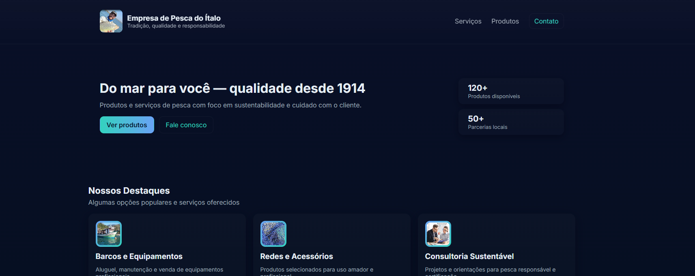

# Site de vendas - Empresa de Pesca do Ítalo
---

## No que consite?

Numa landing page para a empresa *Empresa de Pesca do Ítalo*

## Como rodar?

Primeiro precisamos abrir o servidor, existem algumas formas, vou aprensentar 2 delas:

### Python 🐍

`python -m http.server 8000`

### Php 🐘

`php -S localhost:8000`

Ambos abrem com [esse link](www.localhost:8000)